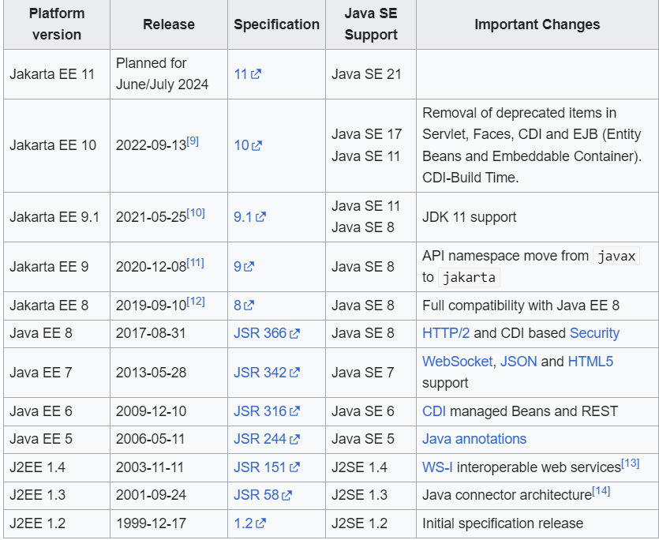

Back - [Java index](0-index.md)

# History
In the first version of Java, Java enterprise extensions were simply a part of the core JDK.
Then, as part of Java 2 in 1999, these extensions were broken out of the standard binaries, and J2EE, or Java 2 Platform Enterprise Edition, was born. It would keep that name until 2006.
For Java 5 in 2006, J2EE was renamed to Java EE or Java Platform Enterprise Edition. That name would stick all the way to September 2017, when something major happened.

_**See, in September 2017, Oracle decided to give away the rights for Java EE to the Eclipse Foundation (the language is still owned by Oracle).**_

# Jakarta EE
Actually, the Eclipse Foundation legally had to rename Java EE. That’s because Oracle has the rights over the “Java” brand.

Jakarta EE, formerly Java Platform, Enterprise Edition (Java EE) and Java 2 Platform, Enterprise Edition (J2EE), is a set of specifications, extending Java SE[1] with specifications for enterprise features such as distributed computing and web services.[2] 

