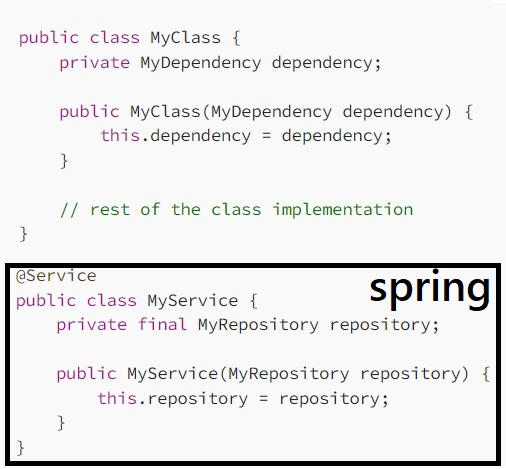
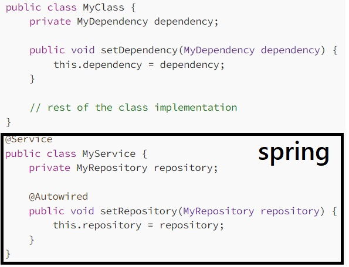
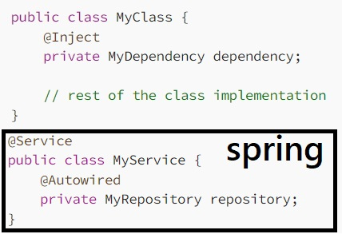
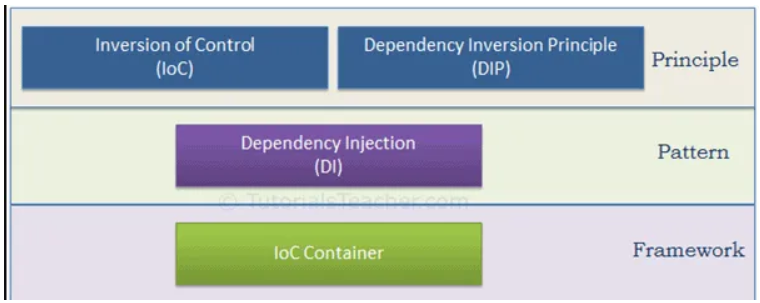

Back to [Index](0-index.md)

# Java web frameworks
1. Spring - Spring MVC Framework follows the MVC pattern
2. Grails - based on the MVC design pattern
3. Google Web Toolkit (GWT) - converts Java code into JavaScript
4. Struts - can be easily integrated with Spring
5. JavaServer Faces (JSF) - instead of using Java, JSF uses XML for view handling 

# Java other frameworks
1. Hibernate - Object-relational mapping framework for a better database communication
2. ** JHipster - Web apps and microservices with Spring Boot and Angular/React/Vue
3. MyBatis - a persistence framework for Java - links Java methods to SQL statements
4. Play - build lightweight and web-friendly Scala applications for desktop and mobile
5. Spark Framework - helps you with developing Java-based web applications, microservices, and REST APIs

## DI = Dependency injection / inversion principle
A technique where objects or functions receive other objects or services that is requires instead of creating them internally. 
This dminishes the inmportance of the new keyword. An injector, container introduces services to the client and the framework handles that.
In Java, there are three main types of dependency injection:

1. Constructor Injection

2. Setter Injection

3. Field Injection

Note that in all three examples, Spring Boot uses the @Autowired annotation to indicate that the dependency should be injected at runtime. Additionally, Spring Boot provides a variety of other annotations that can be used to further control the dependency injection process, such as @Qualifier and @Value.

## ICO Containers
The container will create the objects, wire them together, configure them, and manage their complete life cycle from creation till destruction. The Spring container uses DI to manage the components that make up an application. Guice is another container based framework from google.

There are two types of IoC containers. They are:
- BeanFactory
- ApplicationContext

The ApplicationContext interface is built on top of the BeanFactory interface. It adds some extra functionality.
## Beans
Objects created by a container are called managed objects or beans. The spring container detects beans with annotations on the configuration classes.

## Jakarta EE specification (JAX-RS)
Jakarta RESTful web services is a specification that provides support for creating web services with REST architecture: a uniform interface using HHTP based methods and URI's (web adresses). It has annotations like @Path, @GET, @Consumes, @Produces and @?Param (Path, Query, Header). Known implementations are:
- Jersey from Oracle for json integratino
- Apache CXF, WebSphere IBM,

eg
@Path("/hello")
public class HelloResource {

@GET
public String sayHello() {
return "Hello World";
}
}

## Spring (now 6.0) framework
The Spring programming model does not embrace the Jakarta EE platform specification; rather, it integrates with carefully selected individual specifications from the traditional EE umbrella: Servlet 5/6.0, JPA 3.0/1 etc which have the Jakara namespace. In spring you use @Bean, @Service, @Repository, @Configuration, @Controller, @RequestMapping, @Autowired, @Component, @SpringBootApplication, @EnableAutoConfiguration.

eg
@RequestMapping(value = "/ex/foos", method = RequestMethod.GET)
@ResponseBody
public String getFoosBySimplePath() {
return "Get some Foos";
}

## Spring framework modules
The spring framework is an free inversion of control container for java platform from VMWare. Version 6 is based on Java 17 and jakarta. Modules are
- Spring-core with the IoC container
- Spring modules AOP, JDBC, MVC with hooks for Rest services
  Spring modules are packaged as JAR files in the central maven repository.

## Spring boot
Spring Boot is basically an extension of the Spring framework, which eliminates the boilerplate configurations required for setting up a Spring. It has a starter and embedded server and automatic config for spring functions.

