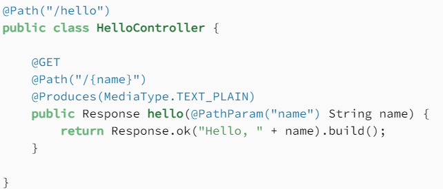
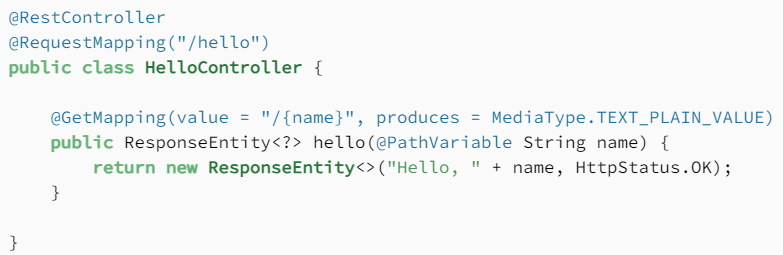

Back to [Index](0-index.md)

## Jakarta EE specification (JAX-RS)
Jakarta RESTful web services is a specification that provides support for creating web services with REST architecture: a uniform interface using HHTP based methods and URI's (web adresses). It has annotations like @Path, @GET, @Consumes, @Produces and @?Param (Path, Query, Header). 
Known implementations are:
- **Jersey** from Oracle for json integrating
- RESTeasy
- Apache CXF, WebSphere IBM,

Jersey

## Spring (now 6.0) framework
The Spring programming model does not embrace the Jakarta EE platform specification; rather, it integrates with carefully selected individual specifications from the traditional EE umbrella: Servlet 5/6.0, JPA 3.0/1 etc which have the Jakara namespace. In spring you use @Bean, @Service, @Repository, @Configuration, @Controller, @RequestMapping, @Autowired, @Component, @SpringBootApplication, @EnableAutoConfiguration.

