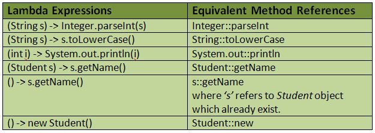

Back to [Index](0-index.md)
# Lambda
## Java 8 - Lambda
A lambda expression is a short block of code which takes in parameters and returns a value. 
Lambda expressions are similar to methods, but they do not need a name and they can be implemented right in the body of a method.
They are similar to Strategy pattern
```java
parameter -> expression OR
(parameter1, parameter2) -> expression OR
(parameter1, parameter2) -> { code block }
        
() → System.out.println(“Hello world from lambda”);
 ```

### Example
```java

public static int compute(int number) {
    return number * 100; // eg slow operation
}

public static void operate(int number) {
    // if a then print else print nothing
}

public static void main (null){
    operate(compute(20));
    operateNormalOrder ...
}

public static void operateNormalOrder(Supplier<Integer> supplier){
}
// -> haskall will not call the print nothing since sometimes its not needed
// pass data to functions applicative order or normal order
// haskall will save some time

// applicative order is order of evaluation of the order of call or application
// normal order is rather abnomal or very rar
// langues liek haskell do thsi extensively

// lambdas are indirection in FP

```

### Method reference 
Java 8 method references can be defined as shortened versions of lambda expressions calling a specific method. Method references are the easiest way to refer a method than the lambdas calling a specific method. Method references will enhance the readability of your code.

ClassName::MethodName // for static methods
ReferenceVariable::MethodName // for instance method of existing object
ClassName::MethodName // for reference to instance method of non-existing object
ClassName::new //  constructor reference



// Venkat DEVOXX 2024
```java
// before 
public static int totalValue(List<Integer> values) {
    var values = List.of(11, 23, 15);

    for (var value : values) {
        // if(value % 2 == 0) only even values
        result += value;
    }
    return result;
}
// don't write a new method for the even values and copy it

// after - refactor before/after you add a feature - but not in the middle
// push the refactor separate - 10% skill / 90% discipline
// commit often and small portions - the cost of undo is less

// pass a function to the case -> 
public static boolean isEven(int number) {
    return number -> number % 2;
}
public static int totalValue(List<Integer> values, Predicate<Integer> selector) {
    // call with values, e -> true OR e -> e % 2 ==0 OR Sample::isEven

    var values = List.of(11, 23, 15);

    for (var value : values) {
            if (selector.test(value) ){
                result += value;
            }
    }
    return result;
}
```