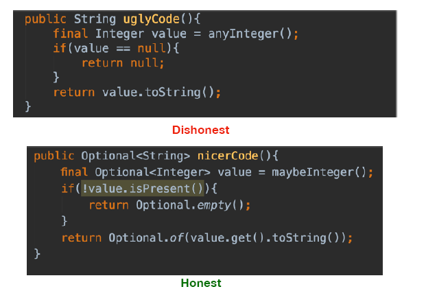

Back to [Index](0-index.md)
# Optional
## Java 8 - Optional
Optional is a concept indicating that a certain entity or object may or may not have a value. Optional should not be used in the hope of getting rid of errors like NPE.
But in case of Optional, when they are calling Optional.get(), you know what they're doing.

// from Venkat DEVOXX 2024
1/2 You want to be confident in programming so no null check everywhere: return value or an Optional<T>
1/2 If you see an optional you know you have to query before use.
3 Don't use Optional<T> for private fields -> just crash
4 Don't use Optional<T> method parameters, they are not benefit eg setInfo(Optional<String> info) {} -> caller has to do extra logic
  - use overloading eg setInfor() {}

(Being Explicit is a good thing)
```java
Optional<User> findUserById(String userId) { ... };
```
By returning Optional User from the function, we have made it clear to the clients of this function that there might not be a User with the given userId. Now the clients of this function are explicitly forced to handle this fact.

**return a String or value**
- .orElseGet() = potentially saving unnecessary db calls when value already present
- .get() = to retrieve a value from Optional
- 
**return a boolean**
- .isPresent() =  to check if there is a value present
- .isEmpty() = use with .ofNullable() to check for null giving 'true'
- **.isEmpty() = use with .of() still gives NPE !!**

**return an Optional<String>** 
- .map() = use to Optional User to an Optional String
eg. map(user -> user.getFirstName())

Dont mix and match .map() with .orElse..
### Example

```java
public static Optional<User> findUserByName(String name) {
    User user = usersByName.get(name);
    Optional<User> opt = Optional.ofNullable(user)
        .map(<doSomething>)
        .orElse("Default value in case of null");
    //  .orElseGet(() -> getNameFromDatabase());
    //  .orElseThrow(()-> new IllegalStateException("Value is empty")));
    return opt;
    
    // plain java from venkat
    if (user == null) {
        return Optional.empty();
    } 
    return Optional.of("data");
            
}

public static void changeUserName(String oldFirstName, String newFirstName) {
    findUserByFirstName(oldFirstName)
        .ifPresent(user -> user.setFirstName(newFirstName));
    //  .ifPresent((user)->System.out.println(user)); 
    //  .ifPresentOrElse // from java 9
}
```
### Optional.of, Optional.ofNullable
Main difference b/w Optional.of and Optional.ofNullable is that if the element wrapped under Optional is null, 
- Optional.of will raise **Null pointer exception** and will stop further processing -> to fast fail bad coding, 
- Optional.ofNullable will just **ignore null** element/object and returns Optional.empty() or NoSuchElementPresent -> for external values you have no control over
```java
Optional<String> text = Optional.of(null); // will give null pointer
Optional<String> text = Optional.ofNullable(null); // NO null pointer
```
### .map() or .filter() on Address from getAddress()
In the below example, map() method returns an empty Optional in the following cases -
- user is absent in userOptional.
- user is present but getAdderess() returns null.
otherwise, it returns an Optional<Address> containing user’s address.

```java
// Extract User's address using map() method.
Optional<Address> addressOptional = userOptional.map(User::getAddress);

// filter address from India
Optional<Address> indianAddressOptional = addressOptional.filter(address -> address.getCountry().equalsIgnoreCase("India"));

// Print, if country is India
indianAddressOptional.ifPresent(() -> {
    System.out.println("User belongs to India");
});
```
In onw single command this is
```java
userOptional.map(User::getAddress)
    .filter(address -> address.getCountry().equalsIgnoreCase("India"))
    .ifPresent(() -> {
        System.out.println("User belongs to India");
});
```
### .flatmap() on Address from getAddress() to prevent ```Optional<Optional<Address>>```
Let’s consider the above map() example again. You might ask that if user’s address can be null then why the heck aren’t you returning 
an ```Optional<Address>``` instead of plain Address from getAddress() method?
And, You’re right! Let’s correct that, let’s now assume that getAddress() returns ```Optional<Address>```. Do you think that above code will still work?

The answer is no! The problem is the following line -
```java
Optional<Address> addressOptional = userOptional.map(User::getAddress)
// Since getAddress() returns Optional<Address>, the return type of userOptional.map() will be Optional<Optional<Address>>
```
```java
Optional<Optional<Address>> addressOptional = userOptional.map(User::getAddress)
// Oops! We certainly don’t want that nested Optional. Let’s use flatMap() to correct that -
```
```java
Optional<Address> addressOptional = userOptional.flatMap(User::getAddress)
// Cool! So, Rule of thumb here - if the mapping function returns an Optional, use flatMap() instead of map() to get the flattened result from your Optional
```

### Compile error - can you spot where
```java
public String getName(Long userId) {
Optional<User> selectedUser = userRepo.findById(userId);
return selectedUser.map(user -> user.getFirstName() + " " + user.getSurName())
.orElseThrow(() -> new IllegalArgumentException("No user found for this id"));
}

//  Optional forces you to actively unwrap an Optional to deal with the absence of a value; as a result, you protect your code against unintended null pointer exceptions.
Optional<T> findById(ID id);
T getById(ID id); // 2.7 -> getReferenceById

public Optional<User> findById(String id) {
    if (u.getReferenceById() == null) {
        return Optional.of(u);
    }
    return Optional.empty();
}

//
User findById(String id).orElseThrow(() -> new ..)));


```
### Before Optional and after

