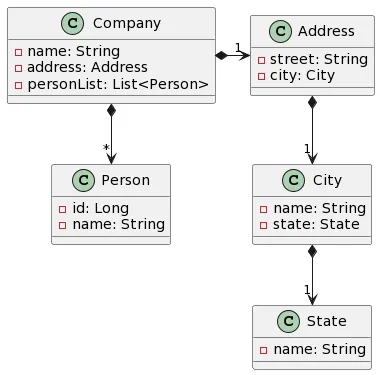

Back to [Index](0-index.md)
# Stream
Java 8 - Stream
We can use Java Stream API to implement internal iteration, that is better because java framework is in control of the iteration.

Prior to Java 8, the approach to do it would be:
```java
private static int sumIterator(List<Integer> list) {
    Iterator<Integer> it = list.iterator();
    int sum = 0;
    while (it.hasNext()) {
        int num = it.next();
        if (num > 10) {
            sum += num;
        }
    }
return sum;
}
```
There are three major problems with the above approach:
- We just want to know the sum of integers but we would also have to provide how the iteration will take place, this is also called external iteration because client program is handling the algorithm to iterate over the list.
- The program is sequential in nature, there is no way we can do this in parallel easily.
- There is a lot of code to do even a simple task.

```java
private static int sumStream(List<Integer> list) {
    return list.stream()
            .filter(i -> i > 10)
            .mapToInt(i -> i)
            .sum();
}
 ```
Stream.of() needs flattening whereas Arrays.stream() does not.
- Stream.of() is generic whereas 
- Arrays.stream is not: Arrays.stream() method only works for primitive arrays of int[], long[], and double[] type, and returns IntStream, LongStream and DoubleStream respectively. 

For other primitive types, Arrays.stream() won’t work. On the other hand, Stream.of() returns a generic Stream of type T (Stream). Hence, it can be used with any type.

### Example

The following code get the city name of the companies addresses:
```java
public List<String> getCityNames(List<Company> companyList){
return companyList.stream()
    .map(company -> company.getAddress().getCity().getName())
    .toList();
}
```
Can be replaced by this to be more readable:
```java
public List<String> getCityNames(List<Company> companyList){
return companyList.stream()
    .map(Company::getAddress)
    .map(Address::getCity)
    .map(City::getName)
    .toList();
}
```
Null checks - The code above with null checks:
```java
public List<String> getCityNames(List<Company> companyList){
return companyList.stream()
    .map(Company::getAddress)
    .filter(Objects::nonNull)
    .map(Address::getCity)
    .filter(Objects::nonNull)
    .map(City::getName)
    .filter(Objects::nonNull)
    .toList();
}
```
### Gets all Persons from all Companies 
```java
class Company {
    private String name;
    private Address address;
    private List<Person> personList;
    
public List<Person> getAllPerson(List<Company> companyList){
  // Make a list of list of Person
  List<List<Person>> partialResult = companyList.stream()
    .map(Company::getPersonList)
    .toList();

  // For each list of Person, add to the result
  List<Person> result = new ArrayList<>();
  partialResult.forEach(result::addAll);

  return result;
}
```
Shorter code with flatmap
```java
public List<Person> getAllPerson(List<Company> companyList){
return companyList.stream()
    .map(Company::getPersonList) // It returns a Stream<List<Person>>
    .flatMap(List::stream)  // It returns a Stream<Person>
    .toList();
}
```
### returns a Map with a List of Company of each city
```java
public Map<City,List<Company>> getCompaniesByCity(List<Company> companyList){
    return companyList.stream()
            .collect(Collectors.groupingBy(company -> company.getAddress().getCity()));
}
```
###  check if there is a company in some city
```java
public boolean hasCompanyInCity(List<Company> companyList, String cityName){
    return companyList.stream()
            .map(Company::getAddress)
            .map(Address::getName)
            .anyMatch(cityName::equals);
    //      .noneMatch(cityName::equals);
}
```
### Use the peek method of write a log for each city
```java
public List<String> getCityNames(List<Company> companyList){
    return companyList.stream()
            .map(Company::getAddress)
            .map(Address::getCity)
            .map(City::getName)
    //      .distinct() get unique city names        
            .peek(cityName -> log.info(cityName))
            .toList();
}
```
