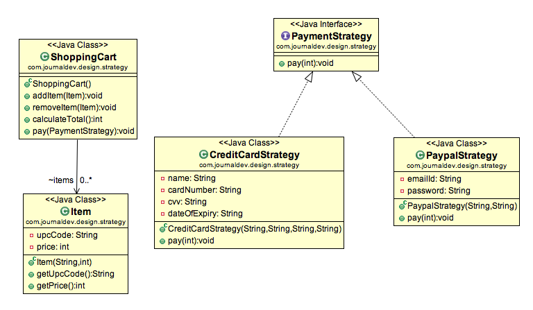

Back - [Java index](0-index.md)

## Behavioral Design Patterns

Pattern Name | Description
- | - 
Template| Method	used to create a template method stub and defer some of the steps of implementation to the subclasses.
Mediator | used to provide a centralized communication medium between different objects in a system.
Chain of Responsibility | used to achieve loose coupling in software design where a request from the client is passed to a chain of objects to process them.
Observer | useful when you are interested in the state of an object and want to get notified whenever there is any change.
Strategy | Strategy pattern is used when we have multiple algorithm for a specific task and client decides the actual implementation to be used at runtime.
Command | Command Pattern is used to implement lose coupling in a request-response model.
State | State design pattern is used when an Object change it’s behavior based on it’s internal state.
Visitor | Visitor pattern is used when we have to perform an operation on a group of similar kind of Objects.
Interpreter | defines a grammatical representation for a language and provides an interpreter to deal with this grammar.
Iterator | used to provide a standard way to traverse through a group of Objects.
Memento | The memento design pattern is used when we want to save the state of an object so that we can restore later on.

### Strategy

Strategy pattern is also known as Policy Pattern. We define multiple algorithms and let client application pass the algorithm to be used as a parameter. One of the best example of strategy pattern is Collections.sort() method that takes Comparator parameter. Based on the different implementations of Comparator interfaces, the Objects are getting sorted in different ways.



```java
... // public class PaypalStrategy implements PaymentStrategy 
	public PaypalStrategy(String email, String pwd){
        this.emailId=email;
        this.password=pwd;
    }
    @Override
    public void pay(int amount) {
        System.out.println(amount + " paid using Paypal.");
    }
... // public class ShoppingCart
    public void pay(PaymentStrategy paymentMethod){
        int amount = calculateTotal();
        paymentMethod.pay(amount);
    }    
...
    
// the run is    
ShoppingCart cart = new ShoppingCart();

Item item1 = new Item("1234",10);
Item item2 = new Item("5678",40);
		
cart.addItem(item1);
cart.addItem(item2);

// pay by paypal
cart.pay(new PaypalStrategy("myemail@example.com", "mypwd"));

// pay by credit card
cart.pay(new CreditCardStrategy("Pankaj Kumar", "1234567890123456", "786", "12/15"));
```

Strategy pattern is useful when we have multiple algorithms for specific task and we want our application to be flexible to chose any of the algorithm at runtime for specific task.

Another example
```java
public interface Discounter {
BigDecimal applyDiscount(BigDecimal amount);

    static Discounter christmasDiscounter() {
        return amount -> amount.multiply(BigDecimal.valueOf(0.9));
    }

    static Discounter newYearDiscounter() {
        return amount -> amount.multiply(BigDecimal.valueOf(0.8));
    }

    static Discounter easterDiscounter() {
        return amount -> amount.multiply(BigDecimal.valueOf(0.5));
    }
}
```